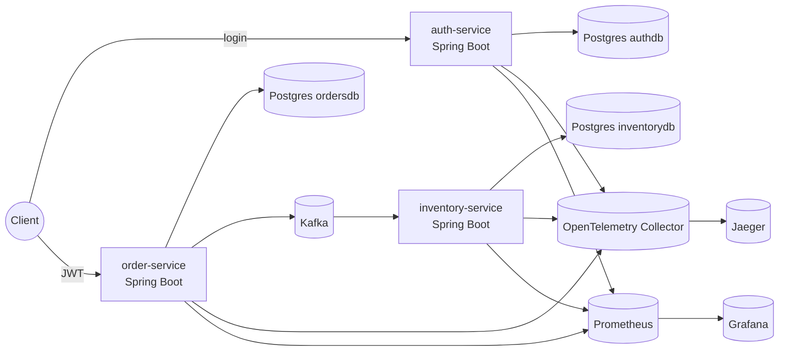

```mermaid
flowchart LR
    Client((Client))
    Auth[auth-service\nSpring Boot]
    Order[order-service\nSpring Boot]
    Inv[inventory-service\nSpring Boot]
    Kafka[(Kafka)]
    AuthDB[(Postgres authdb)]
    OrdersDB[(Postgres ordersdb)]
    InvDB[(Postgres inventorydb)]
    OTel[(OpenTelemetry Collector)]
    Jaeger[(Jaeger)]
    Prom[(Prometheus)]
    Graf[(Grafana)]
    
    Client -->|login| Auth
    Auth --> AuthDB
    
    Client -->|JWT| Order
    Order --> OrdersDB
    Order --> Kafka
    
    Kafka --> Inv
    Inv --> InvDB
    
    Auth --> OTel
    Order --> OTel
    Inv --> OTel
    OTel --> Jaeger
    
    Auth --> Prom
    Order --> Prom
    Inv --> Prom
    Prom --> Graf
```