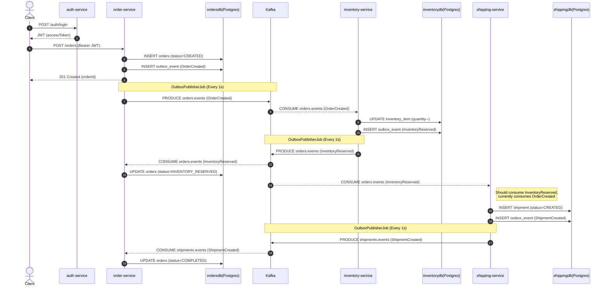

```mermaid
sequenceDiagram
    autonumber
    actor Client
    participant Auth as auth-service
    participant Order as order-service
    participant OrdersDB as ordersdb(Postgres)
    participant Kafka as Kafka
    participant Inv as inventory-service
    participant InvDB as inventorydb(Postgres)
    participant Ship as shipping-service
    participant ShipDB as shippingdb(Postgres)
    
    Client->>Auth: POST /auth/login
    Auth-->>Client: JWT (accessToken)
    
    Client->>Order: POST /orders (Bearer JWT)
    Order->>OrdersDB: INSERT orders (status=CREATED)
    Order->>OrdersDB: INSERT outbox_event (OrderCreated)
    Order-->>Client: 201 Created (orderId)
    
    Note over Order, Kafka: OutboxPublisherJob (Every 1s)
    Order->>Kafka: PRODUCE orders.events (OrderCreated)
    
    Kafka-->>Inv: CONSUME orders.events (OrderCreated)
    Inv->>InvDB: UPDATE inventory_item (quantity--)
    Inv->>InvDB: INSERT outbox_event (InventoryReserved)
    
    Note over Inv, Kafka: OutboxPublisherJob (Every 1s)
    Inv->>Kafka: PRODUCE orders.events (InventoryReserved)
    
    Kafka-->>Order: CONSUME orders.events (InventoryReserved)
    Order->>OrdersDB: UPDATE orders (status=INVENTORY_RESERVED)
    
    Kafka-->>Ship: CONSUME orders.events (InventoryReserved)
    Note right of Ship: Should consume InventoryReserved,<br/>currently consumes OrderCreated
    Ship->>ShipDB: INSERT shipment (status=CREATED)
    Ship->>ShipDB: INSERT outbox_event (ShipmentCreated)
    
    Note over Ship, Kafka: OutboxPublisherJob (Every 1s)
    Ship->>Kafka: PRODUCE shipments.events (ShipmentCreated)
    
    Kafka-->>Order: CONSUME shipments.events (ShipmentCreated)
    Order->>OrdersDB: UPDATE orders (status=COMPLETED)
```