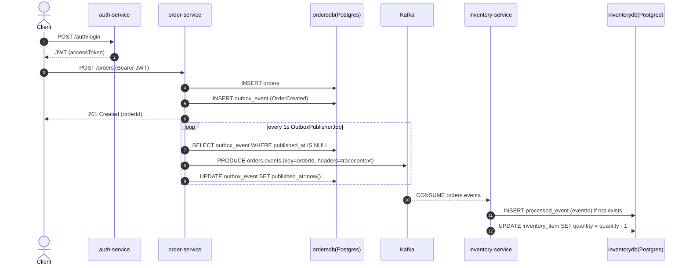

```mermaid
sequenceDiagram
    autonumber
    actor Client
    participant Auth as auth-service
    participant Order as order-service
    participant OrdersDB as ordersdb(Postgres)
    participant Kafka as Kafka
    participant Inv as inventory-service
    participant InvDB as inventorydb(Postgres)
    
    Client->>Auth: POST /auth/login
    Auth-->>Client: JWT (accessToken)
    
    Client->>Order: POST /orders (Bearer JWT)
    Order->>OrdersDB: INSERT orders
    Order->>OrdersDB: INSERT outbox_event (OrderCreated)
    Order-->>Client: 201 Created (orderId)
    
    loop every 1s OutboxPublisherJob
        Order->>OrdersDB: SELECT outbox_event WHERE published_at IS NULL
        Order->>Kafka: PRODUCE orders.events (key=orderId, headers=tracecontext)
        Order->>OrdersDB: UPDATE outbox_event SET published_at=now()
    end
    
    Kafka-->>Inv: CONSUME orders.events
    Inv->>InvDB: INSERT processed_event (eventId) if not exists
    Inv->>InvDB: UPDATE inventory_item SET quantity = quantity - 1
```